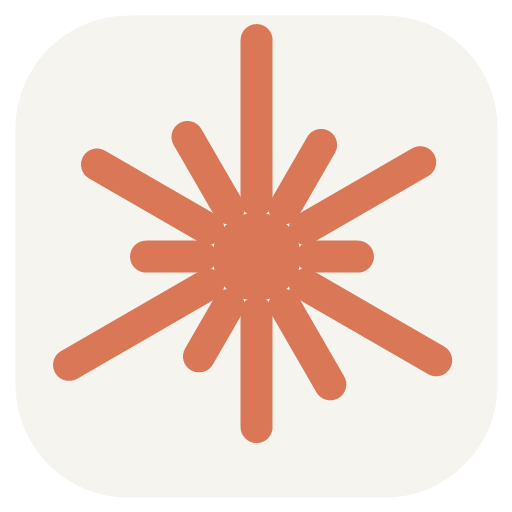
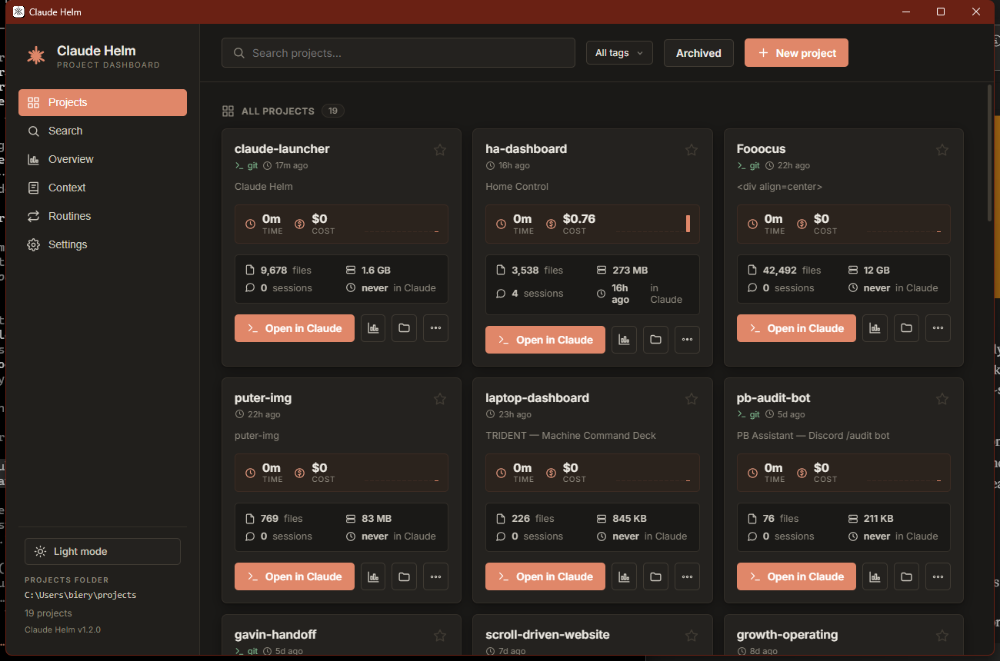

<div align="center">



# Claude Helm

**The dashboard for Claude Code.**
Monitor, search, and launch every project — time, cost, transcripts, and context, all in one place.

[](https://github.com/trifactorscalingllc/claude-helm/releases/latest)


<br/>



</div>

---

Claude Helm reads your local Claude Code history (`~/.claude`) and turns it into a real
dashboard: **how much time and money each project costs, what you worked on, and a one-click
way to jump back in.** It runs entirely on your machine, and it auto-updates itself.

## Download

**[⬇ Download the latest installer](https://github.com/trifactorscalingllc/claude-helm/releases/latest)** → run it → click **More info → Run anyway** at the SmartScreen prompt _(the app isn't code-signed yet)_. After that, it **updates itself silently** — no reinstalling.

---

## Features

### 🚀 Launch
- **One-click "Open in Claude"** — opens a terminal already in the project, running `claude`. No `cd`, no trust prompt.
- **Create projects** from the app (folder + open in Claude in one step).
- **Per-launch overrides** — open *this* project with Opus / Sonnet / Haiku without changing your default.
- **Open in editor** (VS Code, or your file explorer) right from the card.
- **Cross-platform launch** — Windows Terminal, macOS Terminal/iTerm, or your Linux terminal.

### 📊 Monitor
- **Live engine** tails every transcript and computes, per project: **time spent**, **cost** (token×price estimate), sessions, tokens, tools used, files touched, and models.
- **Card metrics** — time, cost, a 14-day activity sparkline, and a live **"● active now"** dot.
- **System tray** — today's time + cost at a glance, plus an active-session indicator. Closing the window keeps it monitoring in the tray.
- **Desktop notifications** — when a session finishes, and when you approach/exceed a budget.
- **Cost alerts & budgets** — set a weekly/monthly budget and get warned at 80% and 100%.

### 📈 Analyze
- **Overview** with a range selector (1 day / 7 days / 1 month / 3 months): per-project history line chart, breakdown table, and a 30-day activity heatmap.
- **Spend forecast** (projected monthly at your current rate) and **spend-by-model** ($ across Opus/Sonnet/Haiku).
- **Project detail** — per-day time/cost charts, token breakdown, tool-usage bars, most-edited files, and a session list.
- **CSV export** of your project stats.

### 🔎 Search & read
- **Unified search** across every conversation **and** your saved context/memory — highlighted snippets, filter by project / date / role.
- **In-app transcript viewer** — read the full conversation as a clean chat; jump straight from a search hit to the exact message.

### 🧠 Context
- See **what Claude remembers about you** — your memory files and global `CLAUDE.md`, grouped into About you / Preferences / Projects / References.

### 🎛 Organize & polish
- **Tags** (client / personal / …) with a tag filter, **archive** to hide projects, **pin** favorites.
- **Dark mode**, first-run onboarding, and a privacy-first, **100% local** design — nothing leaves your machine (the only optional network call is AI summaries, if you add your own API key).

---

## 🔜 Coming soon

- **Routines** — recurring Claude Code tasks on a schedule: a daily standup digest, a weekly retro, a deploy/CI watcher, an inbox/lead sweep, periodic health checks — with results surfaced right in the app. _(The Routines tab is in the app now as a preview.)_
- **Command palette** (Ctrl-K) to jump anywhere from the keyboard.
- **Daily AI recap** — "what did I do today / this week" across all projects.
- **Git status on cards** — branch, dirty/clean, ahead/behind, last commit.
- **Real billed usage** via an Anthropic Admin API key (exact numbers for API/Console users).
- **macOS & Linux** builds.

---

## How it works

- All paths are derived from your home directory at runtime, so it works for **whoever installs it**.
- It reads `~/.claude/projects/**.jsonl` (your Claude Code session transcripts) to compute stats, and your memory folder + `~/.claude/CLAUDE.md` for the Context view.
- Cost is an **estimate** (tokens × public Claude pricing), labeled as such.
- **No telemetry. No account. No data leaves your machine.**

## Build from source

```bash
npm install
npm start        # run in dev
npm run dist     # build the Windows installer into dist/
```

## License

MIT
